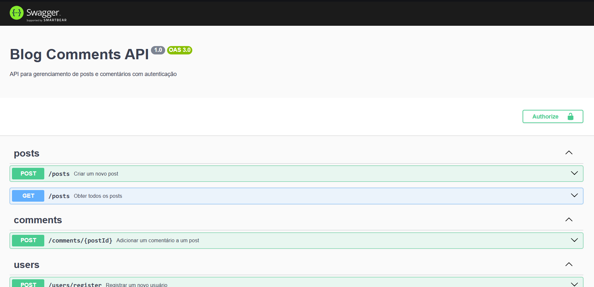

<h3 align = "center" fontSize="60px">
    📄 Blog Comments API
</h3>

<p align="center">
  
</p>

Esta é uma API para um sistema de comentários de blog, desenvolvida com NestJS, TypeORM e PostgreSQL. O projeto possui autenticação com JWT e documentação com Swagger.

## 📋 Sumário

- [✨ Recursos](#-recursos)
- [🛠️ Tecnologias Utilizadas](#️-tecnologias-utilizadas)
- [📋 Pré-requisitos](#-pré-requisitos)
- [📥 Instalação](#-instalação)
- [⚙️ Configuração do Ambiente](#️-configuração-do-ambiente)
- [🚀 Executando o Projeto](#-executando-o-projeto)
- [🧪 Testes](#-testes)
- [📘 Endpoints da API](#-endpoints-da-api)
- [📜 Licença](#-licença)

---

## ✨ Recursos

- CRUD para Posts e Comentários
- Autenticação com JWT
- Documentação da API com Swagger

## 🛠️ Tecnologias Utilizadas

-  [NestJS](https://nestjs.com/)
-  [TypeORM](https://typeorm.io/)
-  [PostgreSQL](https://www.postgresql.org/)
-  [Docker](https://www.docker.com/)
-  [JWT](https://jwt.io/)
-  [Swagger](https://swagger.io/)

## 📋 Pré-requisitos

-  [Node.js](https://nodejs.org/) (versão 14 ou superior)
-  ou  [npm](https://www.npmjs.com/) ou [Yarn](https://yarnpkg.com/)
-  [PostgreSQL](https://www.postgresql.org/)

## 📥 Instalação

1. Clone o repositório:

   ```bash
   git clone https://github.com/Sub-Dev/blog-comments-api-nestjs
   cd blog-comments-api
   ```

2. Instale as dependências:

   ```bash
   npm install
   ```

## ⚙️ Configuração do Ambiente

1.  Crie um arquivo `.env` na raiz do projeto e defina as variáveis de ambiente:

        ```env

    DB_HOST=localhost
    DB_PORT=5432
    DB_USER=nestuser
    DB_PASSWORD=nestpassword
    DB_NAME=blog_comments
    JWT_SECRET=chavesecreta

        ```

2.  Certifique-se de ter um banco de dados PostgreSQL configurado com os mesmos detalhes acima.

## 🚀 Executando o Projeto

1. Execute as migrações:

   ```bash
   npm run migration:run
   ```

2. Inicie o servidor de desenvolvimento:

   ```bash
   npm run start:dev
   ```

3. A API estará disponível em `http://localhost:3000`.

## 🧪 Testes

Este projeto utiliza Jest para testes. Para rodar os testes, execute:

```bash
npm test
```

## 📘 Endpoints da API

A documentação completa dos endpoints está disponível no Swagger. Após iniciar o servidor, acesse:

🔗 [Swagger Documentation](http://localhost:3000/api)

### Exemplos de Endpoints

#### 🔒 Autenticação

- **POST** `/auth/login` — Autentica um usuário e retorna um token JWT.

#### 👤 Usuários

- **POST** `/users/register` — Cria um novo usuário.
- **POST** `/users/login` — Realiza o login do usuário e retorna o token JWT.

#### 📝 Posts

- **POST** `/posts` — Cria um novo post. _(Requer autenticação)_
- **GET** `/posts` — Retorna todos os posts.

#### 💬 Comentários

- **POST** `/comments/:postId` — Adiciona um comentário a um post específico. _(Requer autenticação)_

## 📜 Licença

Distribuído sob a licença MIT. Veja LICENSE para mais informações.
